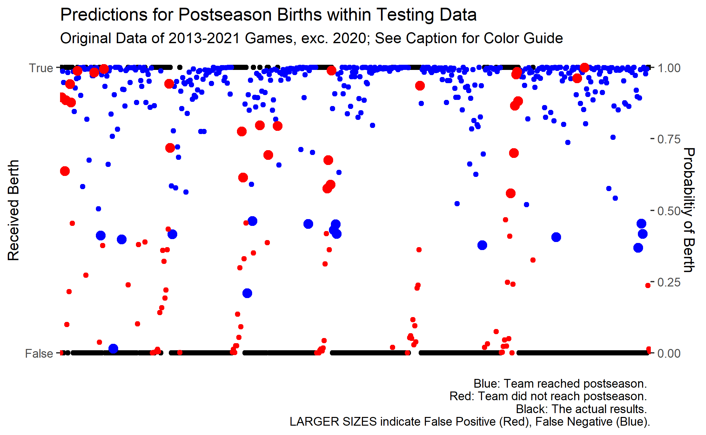

```{r setup, include=FALSE}
knitr::opts_chunk$set(echo = TRUE)
library(tidyverse)
library(ggpubr)
library(ISLR)
library(glmnet)
library(dplyr)
library(tidyr)
library(jtools)
library(interactions)
library(gt)
library(kableExtra)
library(readr)
```

\section{Introduction}

Every year, upwards of 15 million Americans come together to support their favorite college basketball team when the NCAA D1 MBB Tournament begins, affectionally dubbed "March Madness". What makes this tournament so special is that it is full of upsets and late game drama that provide galvanizing and inspiring games throughout the tournament. Furthermore, many Americans partake in predicting the outcomes of tournament games, often times with money on the line with their fellow peers. For example, according to Bloomberg News and Business (https://www.bloomberg.com/graphics/2015-march-madness-gambling/), 9 billion dollars’ worth of cash flow was put into betting in the 2015 March Madness Tournament. Having piqued our interest as a group, we wanted to conduct research on 2 questions regarding college basketball teams and their success throughout the season and tournament: What variables are important in determining the win rate/proportion for a team in a given season? Additionally, how can the 2020 Tournament field be simulated with the data present?

To try to answer these questions, we looked at a College Basketball Dataset that provides information about college basketball teams within power 5 conferences, such as their record, field goal percentage, offensive and defensive efficiency, and much more. With respect to the first question, we wanted to dive into many of the different factors of basketball that lead to wins and losses. This question is very important, considering that the sport-betting industry is gaining traction and is being made legal in more states. Studying teams' tendencies can lead to my making better bets as well as creating a successful prediction of the winner of tournament games. 

With respect to the second question, a significant part of the March Madness Tournament is deciding what teams get into the tournament, as well as what seed each team gets. Depending on how well a team plays during the regular season determines the seed you get in the post season. Using some of the analysis from answering the first question, we can try to simulate what the seeds will be for a mock season. The 2020 college basketball season is the season we wanted to look into because there was a full regular season, but due to COVID-19 there was no tournament. Using the data of the regular season we can attempt to predict the seeding arrangement for what would have been the 2020 tournament.

\section{Data: Determining Win Rate}

In our project, we where overwhelmed by a vast data set with an extensive amount of continuous variables related to performance and results for each team in a respective year, with some of them being of our interest due to most likely being able to predict and create a model for something of high interest such as win rate, as to find what made a "winning team". Win rate was not included in the original data set, so we had to mutate our data frame from the already included G and W fields, by dividing W(wins) by G(games). Our data was first divided into multiple files each corresponding to a certain year, but we decided to combine them together with some information from outside sources, such as 2021 results, which were not included in the original cbb21 file as to have all of the information from 2013-2021 in one file. In later parts of the project, we decided to focus in ADJDE and ADJOE as we thought they would be useful at predicting win rate. We decided to create a density plot of win rate to check out the distributions and have an idea of what we could expect to find in the data. There were also multiple categorical variables in our data set such as TEAM,CONF,RESULT,SEED,POSTSEASON and YEAR, which we later excluded for one of the sections of our project so as to find those continuous variables that are significant and would result in a good model for calculating win rate. 

```{r echo = FALSE}
cbb <- read.csv("../Data/cbbAll.csv")
cbbWIN_RATE <- cbb %>%
  mutate(win_rate = W/G) %>%
  select(-G,-W)

density <- ggplot(cbbWIN_RATE,aes(x=win_rate)) +
  geom_density()
density
```

\begin{center}
Figure 1: Density Plot of Win Rates of D1 MBB Teams, 2013-2021 (excluding 2020)
\end{center}

Some variables of interest:

```{r,echo=FALSE}
dataTribble <- tribble(
                    ~Variable, ~Definition,
                    #-------|-------------
                    "TEAM","Name of the team",
                    "CONF","Conference in which the team participates in",
                    "win_rate","Win rate, derivated from G and W",
                    "G","Amount of games played",
                    "W","Amount of wins",
                    "ADJOE","Adjusted Offensive Efficiency (Estimate of points scored 100 possesions)",
                    "ADJDE","Adjusted Defensive Efficiency (Estimate of points allowed per 100 possesions)",
                    "ORB","Offensive Rebound Rate",
                    "TOR","Turnover Percentage Allowed")
dataTribble
```

\begin{center}
Figure 2: Data Dictionary for Some Important Variables (a comprehensive dictionary can be found at the Kaggle link in the 'Data: Tournament Simulation' section)
\end{center}


Some of what is included in the modified data frame:

```{r,echo = FALSE}
str(cbbWIN_RATE)
```

\begin{center}
Figure 3: Table of Variables and Their Respective Data Types from Dataset used in Figure 1
\end{center}

\section{Results: Determining Win Rate}

In basketball, there are a lot of factors that go into a team becoming a winning team, but we thought that there would be certain stats that could measure how well a team performs in the court, with ADJOE(adjusted offensive efficiency) and ADJDE(adjusted defensive efficiency) being the first ones to cross our mind. The purpose of this section is to compare what could matter most in having a winning team, with ADJOE(adjusted offensive efficiency) and ADJDE(adjusted defensive efficiency) being analyzed with respect to win rate, a statistic calculated from the original data as wins divided by games, as some teams had much more games played than others so the data would be biased towards those teams as more games played meant a bigger chance for much more wins. First, we decided to plot the win rates of all teams with respect to both ADJOE and ADJDE, and we expected those with higher ADJDE to win the less whereas those with higher ADJOE to win the most. There could be teams with a high enough ADJOE that could diminish a high ADJDE and still result in big wins, so we wanted to check whether a balance of both would be favored. First, we wanted to make sure what was more favored in terms to win rate, so by plotting ADJOE and ADJDE vs win rate we were able to see that a low ADJDE and a high ADJOE often resulted in higher win rates, which is as expected. A good defensive team could be expected to have a low ADJDE, while a good offensive team would be expected to have a high ADJOE, so we wanted to research both ends.

```{r, echo = FALSE}
ggplot(data = cbbWIN_RATE, mapping = aes(x = ADJOE, y = win_rate)) + geom_point() + 
  geom_smooth(method = 'lm') + labs(title = "Relationship between Adjusted Offensive Efficiency and Win Rate ", subtitle = "Data shown is of teams in tournaments from 2013-2021.", caption = "WR: Win Rate; ADJOE: Adjusted Offensive Efficiency: Points Scored per 100 Possessions")
```

\begin{center}
Figure 4: Relationship between Adj. Offensive Efficiency, Win Rate
\end{center}

```{r echo = FALSE}
ggplot(data = cbbWIN_RATE, mapping = aes(x = ADJDE, y = win_rate)) + geom_point() + 
  geom_smooth(method = 'lm') + labs(title = "Relationship between Adjusted Defensive Efficiency and Win Rate ", subtitle = "Data shown is of teams in tournaments from 2013-2021.", caption = "WR: Win Rate; ADJDE: Adjusted Defensive Efficiency: Points Allowed per 100 Possessions")
```

\begin{center}
Figure 5: Relationship between Adj. Defensive Efficiency, Win Rate
\end{center}

But still, this is not enough to answer our question, as we still do not know if teams could have both a high ADJOE and high ADJDE or low ADJOE and low ADJDE and still win, or if other variables are still more impactful (that is, additional variables include important explanations in the variability of Win Rates). So, we decided to categorize win rate and ADJDE into three categories each, where each category was an interval of that variable. We divided our graphs by facets using three levels of ADJDE with three box plots each representing a win rate interval. We also used anova to make sure that the means between groups are different, which is what we expected since the start.


```{r,echo = FALSE}
cbbTTEST2 <- cbbWIN_RATE %>%
  mutate(win_rate = ifelse(win_rate >= .75, ">75", ifelse(win_rate >= .50,"<75 and >50", "<50"))) %>%
  mutate(ADJDE = ifelse(ADJDE >= 110, ">110", ifelse(ADJDE >= 95,"<110 and >95", "<95"))) %>%
  select(win_rate,ADJDE,ADJOE)

compare_means(ADJOE ~ win_rate, data = cbbTTEST2)
p <- ggboxplot(cbbTTEST2, x = "win_rate", y = "ADJOE",
          color = "win_rate", palette = "jco",
          add = "jitter")
p + stat_compare_means(method = "anova") + facet_wrap(ADJDE~.)
```

\begin{center}
Figure 6: ANOVA Test for Difference of Means between Categorical Groups of Win Rates
\end{center}

By looking at the box plots, we can see more clearly that there is a relation between ADJOE and win rate, as the boxplots seem to be in a lower ADJOE range as the win rate decreases(which is marked by intervals). What is interesting is that we can eyesight several differences in the groups of ADJDE, with the most significant being that of no team having >75 winrate while also having >110 ADJDE. There also seems to be slight differences in quartiles and ADJOE highs in the box plots when comparing by ADJDE, with the most significant being the difference in highs in ADJOE in the <75 and >50 win rate interval when comparing all ADJDE groups. Another interesting thing is those teams that had a <95 ADJDE seemed to perform well, as most points in the group seem to be concentrated in the <75 and >50 and >75 win rate interval, with a really small fraction being in the <50 win rate interval. Even then, with a much less concentration in points in those ranges not >75, it still remains similar to >75 in magnitude of point presence but with higher ADJOE quartiles and highs, as there are points even in the 130 range. Through these box plots and the above mentioned graphs we were not only able to notice about the effect of ADJOE and ADJDE values and the respective win rates, but also of a suspecting interaction between ADJDE and ADJOE. Because of this, for the next step we decided to use lasso so that we could figure out the most significant variables which we may have missed due to tunneling in ADJOE and ADJDE. In addition, we could also check if there is an interaction between ADJOE and ADJDE, and graph it in case there was.


```{r,echo = FALSE}
#Raw data, discards all categorical values so that win rate can be compared freely in other stats
NONUMERIC <- cbbWIN_RATE %>%
  select(-TEAM,-CONF,-YEAR,-RESULT,-SEED,-POSTSEASON)

# Splitting data into training and testing data
x = model.matrix(win_rate~.^2, NONUMERIC)[,-1]
y = NONUMERIC %>% select(win_rate) %>% unlist() %>% as.numeric()
```

```{r, echo = FALSE, results = 'hide'}
cvfit <- cv.glmnet(x, y, type.measure = "mse", nfolds = 5)
coef(cvfit, s = "lambda.min")
```

```{r, echo = FALSE}
rownames(coef(cvfit, s = 'lambda.min'))[coef(cvfit, s = 'lambda.min')[,1]!= 0] ### returns nonzero coefs
```

\begin{center}
Figure 7: List of Nonzero Coefficients from LASSO Model
\end{center}

```{r echo = FALSE}
modelLASSO <- lm(win_rate ~ ADJOE + ADJDE + ADJOE:ADJDE,data = NONUMERIC)
summary(modelLASSO) 

interaction1 <- lm(win_rate ~ ADJOE*ADJDE, data = NONUMERIC)
interact_plot(interaction1, pred = ADJOE, modx= ADJDE, interval = TRUE, int.width = 0.9)
```

\begin{center}
Figure 8: Interaction Plot between Adj. Offensive, Defensive Efficiency and Win Rate 
\end{center}

After performing LASSO techniques, we were able to notice that that win rate was not something attributed to just a couple variables like ADJOE and ADJDE as we suspected, but a lot of variables also included in the data set and their interactions were also found to be significant. We were overwhelmed by the amount of significant variables outputted by lasso, as we did not consider them at the start of the project, but since they were a lot for the scope of this project we still decided to focus in ADJOE and ADJDE as their interaction mentioned before was found to be significant. In addition, we found that that just using ADJOE or ADJDE by themselves were significant enough, as shown by the table with the col names of those found to be significant. Next, we created an interaction plot of ADJOE with ADJDE and compared the three different lines categorized by different ADJDE standard deviations by win rate, and our results were what we expected as we found the line with an ADJDE of -1 SD to be the one with a higher intercept and higher win rate peak, and that with an ADJDE of +1 SD to be the one with the lowest intercept and lowest peak. However, as ADJOE increased, the win rate of all three lines also increased, and were fairly similar at where they peaked but still the difference of peaks could be seen clearly. In addition, ADJOE and ADJDE were found to be significant not only with their interaction, but also in interactions with other variables. Still, win rate was something much more complex that could not only be explained by just the interaction of ADJDE and ADJOE. A good model for calculating win rate could not only be created using ADJOE and ADJDE, but would also include a lot more variables, especially those such as WAB(wins above cutoff for making March Madness) or barthag(power rating).

\newpage
\section{Data: Tournament Simulation}

Of particular interest in simulating the 2020 Tournament are datasets that encapsulate teams' summary statstics for any given season (2013-2021) and another that recounts the history of the Tournament by game. The first of these datasets contains a number of important summary statistics, many of which were discussed earlier in this section (e.g., ADJOE, ADJDE, ORB, TOR); each statistic is a representation of some aspect of the game of basketball, and higher/lower values of some statistics are often accompanied by higher win rates (see the Results section for additional commentary). Figure 9 provides a visualization of how this dataset is structured; note that, for 2020, the 'RESULT','SEED', and 'POSTSEASON' columns do not exist (these indicate how far a team went in the tournament, their seed that year, and whether or not they were invited, respectively).

\begin{table}[ht]
\centering
\begin{tabular}{rllrrrrrrrr}
  \hline
 & TEAM & CONF & G & W & ADJOE & ADJDE & BARTHAG & EFG\_O & EFG\_D & TOR \\ 
  \hline
1 & Michigan & B10 &  24 &  20 & 118.10 & 91.10 & 0.95 & 54.90 & 44.90 & 16.30 \\ 
  2 & Baylor & B12 &  24 &  22 & 123.20 & 94.50 & 0.95 & 57.50 & 49.10 & 17.60 \\ 
  3 & Illinois & B10 &  29 &  23 & 117.70 & 90.40 & 0.95 & 55.60 & 46.60 & 18.20 \\ 
  4 & Gonzaga & WCC &  26 &  26 & 125.40 & 89.80 & 0.98 & 61.00 & 47.50 & 16.10 \\ 
  5 & Iowa & B10 &  29 &  21 & 123.50 & 95.70 & 0.95 & 54.60 & 48.30 & 13.30 \\ 
   \hline
\end{tabular}
\end{table}

\begin{center} Figure 9: Sample Summary Statistics from 2021 Season (some columns not shown due to cutoff) \end{center}

Additionally, Figure 10 shows a small sample of games from the history of the NCAA Tournament (all games since 1985 were stored in this format).

| Year | Seed1 | Score1 | Team1        | Team2              | Score2 | Seed2 | ScoreDiff | Upset |
| ---- | ----- | ------ | ------------ | ------------------ | ------ | ----- | --------- | ----- |
| 2013 | 1     | 79     | Louisville   | North Carolina A&T | 48     | 16    | 31        | 0     |
| 2013 | 2     | 73     | Duke         | Albany             | 61     | 15    | 12        | 0     |
| 2013 | 3     | 65     | Michigan St. | Valparaiso         | 54     | 14    | 11        | 0     |
| 2013 | 4     | 64     | Saint Louis  | New Mexico St.     | 44     | 13    | 20        | 0     |
\begin{center} Figure 10: Sample Data from History of NCAA Tournament Games \end{center}

\subsection{Sourcing Used Datasets}

The following links or methods of obtaining the predominant resources used in the compilation of this report:

* Kaggle Repository containing dataset(s) depicted in Figure 1: [**Link**](https://www.kaggle.com/andrewsundberg/college-basketball-dataset)

* ESPN Link to 2021 Tournament Data (merged with Kaggle Repository to include results from this year): [**Link**](https://www.espn.com/mens-college-basketball/ncaa-tournament/)

* Link to Warren Nolan's website containing historical BPI Data (merged with Kaggle Repository and ESPN data): [**Link**](https://www.warrennolan.com/)

* Data.World Link containing datasets depicted in Figure 2: [**Link**](https://data.world/michaelaroy/ncaa-tournament-results)

\newpage

\section{Results: Simulating the 2020 Tournament}

As the world grinded to a halt in March of 2020, college basketball, which had 
been preparing for conference tournaments and the "Big Dance," as the tournament
to which the entire season culminates is coloquially referred, stopped alongside 
it. The cancellation brought about speculation of who would have comprised the 
elusive fields of 68, what "Cinderella stories" would have been, and who would
have emerged the Champion. 

Fortunately, advancements in machine learning and classification techniques, 
along with their practical applications in the blossoming field of data science,
afford the ability to re-create college basketball's greatest tournament. The 
following sections will be dedicated to the discussion of how the 2020 NCAA D1 MBB
Tournament can, and will, be simulated. The first section will be dedicated to 
the definition of the aforementioned "field of 68" teams, along with relevant
terminology and slang phrases used to discuss the results of such tournaments. 
Next, the development of classification tools to structure the tournament
field will be discussed, which include methods such as Support Vector Machines (SVM),
K-Nearest Neighbors (KNN) or K-Means Clustering algorithms, and the use of 
Artifical Neural Networks (ANN). Finally, the same methods will be appropriated 
to creating methods of determining the victor of a particular match-up. These 
two facets comprise how the tournament progresses. Results of each round, along with the eventual champion (no virtual banner for UNC, unforunately), will be presented as well.

\subsection{Relevant Terminology}

Before discussing how any classification methods work or their respective performances, a framework for understanding them must be established, especially for audiences who are not acclimated nor familiar with the college basketball environment in recent years (i.e since 2011, when the 'First Four' games were included to broaden the field from 64 to 68 teams). Therefore, let the following list serve as a guide to the words and phrases repeatedly used throughout this analysis:

* *Field*: This is a coloquial term referencing the entire scope of teams who receive an invitation to the tournament. 

* *Automatic [Bid]*: This term refers to teams who are conference champions within their contemporaneous and respective tournaments. Conference champions receive an invitation to the tournament, no matter from where they originate.

* *At-Large*: This term refers to teams who received an invitation to the tournament but were not automatically entered; a committee is responsible for determining these teams.

* *Seed*: A team's ranking within their region/pool, ranging from 1 (Best) to 16 (Worst).

* *Region*: The tournament is divided into four regions, and thus four of each seed enter the first round, dubbed the 'Round of 64.' (Six '11-seeds' and '16-seeds' are chosen, but four of each enter the 'First Four' games, likely determined by a committee.)

* *Upset*: Such refers to a game in which the result is a significantly lower-seeded team defeating a high-seeded team (e.g., see Duke-Lehigh in 2012, Duke-Mercer in 2014, Virginia-UMBC in 2019, Ohio State-Oral Roberts in 2021).

Other terms, such as the names given to different rounds of the tournament, should be self-explanatory; that is, the number in any respective name (aside of the Championship Round) indicates the number of remaining teams.

\subsection{The Field of 68}

Since 2011, in which the tournament has been held included 68 teams who shared one common goal: "Win or Go Home." But before such goals can be realized, they first are made aware of their initial opponent. A committee is appointed (as to who exactly comprises said group, the authors are unsure) to carry out the selection process, which involves the assignment of seeds 1-16 to teams based on a number of statistics (e.g., Strength of Schedule, or SOS, which is a ranking given to identify the team(s) with the most difficult slate of games over the entire season). Four teams are allotted each seed, with the aforementioned explanation of two additional seeds being offered to fill out the first games that are played the day before the tournament is scheduled to begin. As a result, "1-seed" teams play "16-seed" opponents, "2-seed" teams play "15-seed" opponents, and so on. Teams are then split into four regions, where each region is a microcosm consisting of a single team seeded 1-16. The winners of each region arrive at the 'Final Four' round, and the winners of those games compete for the title.

\subsection{Methods}

Accurately structuring any tournament field can be difficult, and March Madness is no exception. Bracketologists (such as Joe Lunardi), individuals who employ analysis of historical records and current performances to predict fields, labor throughout the season to communicate to the public their opinions on who will reach the postseason. This section allows the authors to assume this role (and, when the time comes, hopefully win their next office or family bracket competitions) with the help of aforementioned classification techniques. 

The goal of this subsection is to structure the field of 68 teams that would have hypothetically competed for the championship. Such is a two-step process: first, the field will be generated by determining worthiness for a postseason berth. Afterwards, teams will be seeded according to a separate set of classifiers. Finally, regression techniques will be used to simulate matchups designed in a traditional tournament format (see Appendix for the full results)!

It is worth noting that all of the described methods were tested on data *independent* from data on the 2020 season beforehand to ensure validity of the process (e.g., prevent overfitting and poor classification amongst test data) and become acclimated with the programming necessary to achieve an end-goal. Some of the included output will be from randomly selected test data, others exclusively the 2020 season. 

\subsubsection{Postseason Berth}

**SVM**

Simply put, the term "postseason berth" refers to any given team being included in the tournament, whether in the First Four or Round of 64. In order to simulate this for the 2020 season, classifiers were trained on data from the 2013-2021 tournaments (excluding 2020). No weighting nor mutation of the data was conducted as a result of how far a team progressed in the tournament, but instead only their presence was noted. 

A train-test split ratio of 80/20 (that is, trained on 80% of the data, tested on 20%) was used in the generation of an SVM classifier. Hyperparameters, along with their respective results of Accuracy ("Acc"), Precision ("Prec"), and Sensitivity ("Sens"), common metrics used to describe SVMs and Confusion Matrices, were used to tune the classifier; the best set of aforementioned metrics belonged to the parameters $C = 1, \gamma = 1$, where $C$ is the 'cost' parameter and $\gamma$ the 'gamma' parameter. 

Additionally, when tested, this SVM performed relatively well, as indicated by
the confusion matrix

$$
\begin{bmatrix}
TP & FP \\
FN & TN
\end{bmatrix} = 
\begin{bmatrix}
437 & 15 \\
28 & 80
\end{bmatrix}
$$

where $TP$ signifies "True Positive," $FN$ "False Negative," and the like.

\begin{center} Figure 11: Confusion Matrix of SVM Postseason Berth Classifier \end{center}


\begin{center} Figure 12: Probabilities of Postseason Berths, 2013-2019 and 2021) \end{center}

As evidenced by Figures 11 and 12, the SVM was confident in many of its classifications of teams' eligibility for postseason appearances, so much so that it failed to identify an adequate-sized field when validated on data from 2020. To combat this shortcoming, any results marking a team eligible for an appearance were coupled with the necessary number of *low-confidence* predictions of a team *not* making it into the postseason (e.g., as 43 teams were automatically selected, 25 were chosen among those initially not selected). 

**KNN**

In addition to an SVM, a K-Means Clustering approach known as "K-Nearest Neighbors" was introduced. To tune the hyperparameter $k$ for this algorithm, classifiers tested on data from 2020 were compared with respect to $\mu_{pv != av}$. Note that 'pv' and 'av' represent the predicted and actual values (e.g., the predictions and test dataset, respectively). Figure 13 on the following page shows that a value of $k = 6$ minimized this function and was thus used in the determination of postseason berths.


\begin{center} Figure 13: Plot of Hyperparameter Tuning for Postseason-Berth KNN Classifier) \end{center}

When validated using data from 2020, a similar scenario occurred to that when using the SVM classifier; as a result, 49 teams received automatic berths, and 19 were chosen among those initially not selected.

**ANN**

Finally, an Artificial Neural Network was included for determining postseason eligibility. The model was trained and tested on the same data sources as the SVM and KNN before also being validated with data from 2020. Surprisingly, this network performed extremely well, boasting a "train-accuracy" of ~$0.925$ and "test-accuracy" of ~$0.916$.

The model structure is defined below (taken from output of the .py file from where the model originates).


\begin{center} Figure 14: Table of Postseason ANN Structure) \end{center}

\subsubsection{Field Generation}

When each of the aforementioned classifiers were validated using data from 2020, their predictions were used to each determine a set of teams to label with seeds. The code (under the 'Field Generation' section of the main script) for the following section employs filtered datasets from the validation data for each set of predictions. Rather than re-hash descriptions of each classifier for this different purpose (because accuracies cannot be measured, as there are no values to use as comparison), the results of each classifier will be presented, along with an explanation of necessary methods of imputation and analysis to arrive at a finalized tournament field.

For *each* classifier, its prediction indices for postseason berths were cross-referenced with team-names from the validation data to obtain a list of 68 teams. As mentioned before, if a classifier failed to predict the necessary number of berths, then additional values were imputed based on having the lowest remaining probabilities of *not* being given an invitation. Each list was then trained on a separate set of classifiers (of the same techniques as above) that labeled each team with a seed. As a result, each seed classifier yielded a *68x2* table represent its predicted field and seeds for each field.

The three tables were then joined, allowing for missing values, to arrive at a *105x3* table. Automatic bids were determined by selecting teams who had predicted values for all three classifiers (before imputation), ranking their average seeds, and seeding in chunks of $4$ teams per increment. Missing values were imputed with the value $16$ as any classifier who desired *not* to include them in predictions communicated that something about such teams' statistics did not warrant a postseason appearance and, as 16-seeds often have an early exodus (only *1* in the entire tournament history has won a game), such value acts as a penalty to ultimately match such teams with higher-seeds who are, from a historical perspective, more likely to win. 

At-large bids were selected under the following process: first, the average seed of all teams not receiving automatic bids were computed and ranked in ascending order. Then, the highest $n$ rankings were selected. It should be admitted that **this process is different than how selection committees normally proceed**, with conference champions being given automatic seeds and all other teams competing for at-large bids; the authors felt that the process used in this report incorporated a rigorous use of classification techniques and that such process would be better suited without the premature filtration of teams that were not conference champions in 2020.

The following table, beginning on the next page, shows the rankings of the 43 automatic bids and 25 at-large bids (the 'Rank' column starts anew because the two groups were compiled and ranked separately):

\newpage

| TEAM               | KNN | SVM | ANN | means    | Rank | Seed |
| ------------------ | --- | --- | --- | -------- | ---- | ---- |
| Kansas             | 1   | 1   | 1   | 1        | 1    | 1    |
| Gonzaga            | 1   | 1   | 1   | 1        | 2    | 1    |
| Baylor             | 3   | 3   | 1   | 2.333333 | 3    | 1    |
| Dayton             | 3   | 3   | 1   | 2.333333 | 4    | 1    |
| San Diego St.      | 5   | 2   | 1   | 2.666667 | 5    | 2    |
| Florida St.        | 3   | 4   | 1   | 2.666667 | 6    | 2    |
| Creighton          | 5   | 3   | 1   | 3        | 7    | 2    |
| Villanova          | 5   | 3   | 1   | 3        | 8    | 2    |
| Duke               | 4   | 3   | 3   | 3.333333 | 9    | 3    |
| Maryland           | 6   | 3   | 1   | 3.333333 | 10   | 3    |
| Michigan St.       | 5   | 3   | 3   | 3.666667 | 11   | 3    |
| Louisville         | 5   | 5   | 3   | 4.333333 | 12   | 3    |
| Penn St.           | 3   | 5   | 5   | 4.333333 | 13   | 4    |
| Oregon             | 5   | 5   | 3   | 4.333333 | 14   | 4    |
| Kentucky           | 6   | 4   | 3   | 4.333333 | 15   | 4    |
| Virginia           | 5   | 5   | 3   | 4.333333 | 16   | 4    |
| Ohio St.           | 6   | 5   | 3   | 4.666667 | 17   | 5    |
| Auburn             | 6   | 6   | 3   | 5        | 18   | 5    |
| Butler             | 6   | 7   | 3   | 5.333333 | 19   | 5    |
| West Virginia      | 6   | 6   | 5   | 5.666667 | 20   | 5    |
| Seton Hall         | 9   | 5   | 3   | 5.666667 | 21   | 6    |
| Michigan           | 5   | 8   | 5   | 6        | 22   | 6    |
| Houston            | 7   | 7   | 5   | 6.333333 | 23   | 6    |
| Arizona            | 3   | 5   | 11  | 6.333333 | 24   | 6    |
| Wisconsin          | 9   | 7   | 3   | 6.333333 | 25   | 7    |
| Illinois           | 7   | 8   | 5   | 6.666667 | 26   | 7    |
| Iowa               | 8   | 8   | 5   | 7        | 27   | 7    |
| Oklahoma           | 9   | 7   | 6   | 7.333333 | 28   | 7    |
| BYU                | 11  | 7   | 6   | 8        | 29   | 8    |
| Rutgers            | 5   | 8   | 11  | 8        | 30   | 8    |
| Saint Mary's       | 11  | 7   | 6   | 8        | 31   | 8    |
| Cincinnati         | 5   | 8   | 11  | 8        | 32   | 8    |
| USC                | 5   | 8   | 11  | 8        | 33   | 9    |
| Colorado           | 7   | 8   | 11  | 8.666667 | 34   | 9    |
| Providence         | 6   | 10  | 11  | 9        | 35   | 9    |
| LSU                | 8   | 8   | 11  | 9        | 36   | 9    |
| Utah St.           | 7   | 11  | 11  | 9.666667 | 37   | 10   |
| Richmond           | 11  | 7   | 11  | 9.666667 | 38   | 10   |
| Texas Tech         | 9   | 9   | 13  | 10.33333 | 39   | 10   |
| Marquette          | 11  | 10  | 11  | 10.66667 | 40   | 10   |
| Indiana            | 10  | 11  | 11  | 10.66667 | 41   | 11   |
| Florida            | 11  | 11  | 11  | 11       | 42   | 11   |
| Memphis            | 5   | 16  | 13  | 11.33333 | 1    | 11   |
| Wichita St.        | 16  | 7   | 11  | 11.33333 | 2    | 11   |
| Purdue             | 10  | 10  | 16  | 12       | 3    | 11   |
| Syracuse           | 10  | 11  | 16  | 12.33333 | 4    | 11   |
| Washington         | 5   | 16  | 16  | 12.33333 | 5    | 12   |
| Arizona St.        | 10  | 16  | 11  | 12.33333 | 6    | 12   |
| Northern Iowa      | 11  | 16  | 11  | 12.66667 | 7    | 12   |
| Xavier             | 12  | 10  | 16  | 12.66667 | 8    | 12   |
| Rhode Island       | 11  | 16  | 11  | 12.66667 | 9    | 13   |
| East Tennessee St. | 12  | 16  | 11  | 13       | 10   | 13   |
| Yale               | 11  | 16  | 13  | 13.33333 | 11   | 13   |
| Saint Louis        | 12  | 16  | 13  | 13.66667 | 12   | 13   |
| Liberty            | 11  | 16  | 14  | 13.66667 | 13   | 14   |
| Tennessee          | 9   | 16  | 16  | 13.66667 | 14   | 14   |
| Arkansas           | 11  | 16  | 15  | 14       | 15   | 14   |
| Oklahoma St.       | 10  | 16  | 16  | 14       | 16   | 14   |
| Connecticut        | 10  | 16  | 16  | 14       | 17   | 15   |
| St. John's         | 10  | 16  | 16  | 14       | 18   | 15   |
| Akron              | 11  | 16  | 15  | 14       | 19   | 15   |
| Northern Colorado  | 11  | 16  | 16  | 14.33333 | 20   | 15   |
| Notre Dame         | 11  | 16  | 16  | 14.33333 | 21   | 16   |
| Alabama            | 11  | 16  | 16  | 14.33333 | 22   | 16   |
| Texas              | 16  | 16  | 11  | 14.33333 | 23   | 16   |
| Stephen F. Austin  | 16  | 16  | 11  | 14.33333 | 24   | 16   |
| Davidson           | 13  | 16  | 16  | 15       | 25   | 16   |
| Iowa St.           | 15  | 16  | 16  | 15.66667 | 26   | 16   |
\begin{center} Figure 15: Rankings and Seeds of Simulated 2020 Tournament Teams \end{center}

\subsection{Tournament Simulation}

In order to simulate the tournament with the above list of teams, a method to determine a victor for any given contest must first be derived. Using the "TEAM", "Team1", and "Team2" columns from the datasets shown in Figures 9 and 10 as primary keys, the following process was carried out:

* For all games from 2013-2019, compute the differences of all quantitative statistics (except 'SEED' and other categorical variables) between the two teams that competed in each contest (Figure 16, below).

* Create a regression model that predicts the difference in score (along with its sign, as it indicates which team emerged victorious).

* For teams in Figure 15, create and simulate games according to whether or not the regression model returned a positive or negative value (the magnitude represents a quasi-"betting line", how many points one team is expected to win by). Repeat this step for each region of the tournament and record the victor(s).

The regression model initially contained all of the aforementioned differences, and was minimized using stepwise regression under the *BIC* criterion. Ultimately, the following regression equation was used to simulate the 2020 Tournament: *ScoreDiff ~ ADJOE_DIFF + ADJDE_DIFF + TORD_DIFF + WAB_DIFF*.

Figure 7 includes sample differences from the games depicted in Figure 1 (the figures are snapshots of the same dataset).

| ADJOE\_DIFF | ADJDE\_DIFF | BARTHAG\_DIFF | EFG\_O\_DIFF | EFG\_D\_DIFF | 
| ----------- | ----------- | ------------- | ------------ | ------------ | 
| 25.3        | \-11.2      | 0.628         | 4.9          | \-0.4        | 
| 17.2        | \-7.2       | 0.378         | 4.3          | \-2.8        | 
| 3.6         | \-10.1      | 0.188         | \-5.1        | \-1.7        | 
| 5.5         | \-7.8       | 0.219         | 1.1          | 0.1          | 
| 2.3         | 0           | 0.025         | \-0.5        | \-1.9        |  
\begin{center} Figure 16: Differenced Statistics for Games from Figure 1 (most columns not depicted due to cutoff). \end{center}

The difference statistics were created and passed to the regression model for each simulated game. Figure 17 shows the results of simulating each round of the tournament, including the victor and the difference in score (negative values indicate an "upset" victory).

| ID                          | DIFF  | TEAM          | ROUND                          |
| --------------------------- | ----- | ------------- | ------------------------------ |
| Syracuse-Iowa St.           | 5.7   | Syracuse      | First Four                     |
| Purdue-Texas                | 9.6   | Purdue        | First Four                     |
| Kansas-Notre Dame           | 9.5   | Kansas        | East - Round of 64             |
| San Diego St.-Connecticut   | 4     | San Diego St. | East - Round of 64             |
| Duke-Liberty                | 11.8  | Duke          | East - Round of 64             |
| Penn St.-Rhode Island       | 7.8   | Penn St.      | East - Round of 64             |
| Ohio St.-Washington         | 5.2   | Ohio St.      | East - Round of 64             |
| Seton Hall-Indiana          | 4     | Seton Hall    | East - Round of 64             |
| Wisconsin-Utah St.          | 3.1   | Wisconsin     | East - Round of 64             |
| BYU-USC                     | 9.3   | BYU           | East - Round of 64             |
| Kansas-BYU                  | 4.3   | Kansas        | East - Round of 32             |
| San Diego St.-Wisconsin     | 3.4   | San Diego St. | East - Round of 32             |
| Duke-Seton Hall             | 5.9   | Duke          | East - Round of 32             |
| Penn St.-Ohio St.           | \-0.9 | Ohio St.      | East - Round of 32             |
| Kansas-Ohio St.             | 3.1   | Kansas        | East - Sweet 16                |
| San Diego St.-Duke          | \-1.7 | Duke          | East - Sweet 16                |
| Kansas-Duke                 | 1.9   | Kansas        | East - Elite 8                 |
| Dayton-Davidson             | 8.6   | Dayton        | West - Round of 64             |
| Villanova-Northern Colorado | 6.4   | Villanova     | West - Round of 64             |
| Louisville-Oklahoma St.     | 6.2   | Louisville    | West - Round of 64             |
| Virginia-Saint Louis        | \-0.1 | Saint Louis   | West - Round of 64             |
| West Virginia-Xavier        | 5     | West Virginia | West - Round of 64             |
| Arizona-Wichita St.         | 7     | Arizona       | West - Round of 64             |
| Oklahoma-Marquette          | \-0.7 | Marquette     | West - Round of 64             |
| Cincinnati-LSU              | 0.4   | Cincinnati    | West - Round of 64             |
| Dayton-Cincinnati           | 9.1   | Dayton        | West - Round of 32             |
| Villanova-Marquette         | 1.9   | Villanova     | West - Round of 32             |
| Louisville-Arizona          | \-0.3 | Arizona       | West - Round of 32             |
| Saint Louis-West Virginia   | -3.3  | West Virginia | West - Round of 32             |
| Dayton-West Virginia        | 5.5   | Dayton        | West - Sweet 16                |
| Villanova-Arizona           | \-3   | Arizona       | West - Sweet 16                |
| Dayton-Arizona              | 3.4   | Dayton        | West - Elite 8                 |
| Baylor-Stephen F. Austin    | 14.3  | Baylor        | Midwest - Round of 64          |
| Creighton-Akron             | 11.6  | Creighton     | Midwest - Round of 64          |
| Michigan St.-Arkansas       | 5.5   | Michigan St.  | Midwest - Round of 64          |
| Kentucky-Yale               | 5.6   | Kentucky      | Midwest - Round of 64          |
| Butler-Northern Iowa        | 5.6   | Butler        | Midwest - Round of 64          |
| Houston-Memphis             | 8.1   | Houston       | Midwest - Round of 64          |
| Iowa-Texas Tech             | \-3.2 | Texas Tech    | Midwest - Round of 64          |
| Saint Mary's-Providence     | \-3.4 | Providence    | Midwest - Round of 64          |
| Baylor-Providence           | 5     | Baylor        | Midwest - Round of 32          |
| Creighton-Texas Tech        | 1.6   | Creighton     | Midwest - Round of 32          |
| Michigan St.-Houston        | 2.5   | Michigan St.  | Midwest - Round of 32          |
| Kentucky-Butler             | 0.2   | Kentucky      | Midwest - Round of 32          |
| Baylor-Kentucky             | 9.1   | Baylor        | Midwest - Sweet 16             |
| Creighton-Michigan St.      | 2.4   | Creighton     | Midwest - Sweet 16             |
| Baylor-Creighton            | 2.9   | Baylor        | Midwest - Elite 8              |
| Gonzaga-Alabama             | 8.7   | Gonzaga       | South - Round of 64            |
| Florida St.-St. John's      | 2.1   | Florida St.   | South - Round of 64            |
| Maryland-Tennessee          | 0.9   | Maryland      | South - Round of 64            |
| Oregon-East Tennessee St.   | 9.5   | Oregon        | South - Round of 64            |
| Auburn-Arizona St.          | 1.1   | Auburn        | South - Round of 64            |
| Michigan-Florida            | 1.6   | Michigan      | South - Round of 64            |
| Illinois-Richmond           | 2.4   | Illinois      | South - Round of 64            |
| Rutgers-Colorado            | 2.4   | Rutgers       | South - Round of 64            |
| Gonzaga-Rutgers             | 8     | Gonzaga       | South - Round of 32            |
| Florida St.-Illinois        | 2.9   | Florida St.   | South - Round of 32            |
| Maryland-Michigan           | \-2.8 | Michigan      | South - Round of 32            |
| Oregon-Auburn               | 6.9   | Oregon        | South - Round of 32            |
| Gonzaga-Oregon              | 5.7   | Gonzaga       | South - Sweet 16               |
| Florida St.-Michigan        | 0     | Florida St.   | South - Sweet 16               |
| Gonzaga-Florida St.         | 7.5   | Gonzaga       | South - Elite 8                |
| Kansas-Dayton               | 0.6   | Kansas        | Final Four (East vs. West)     |
| Gonzaga-Baylor              | 1.6   | Gonzaga       | Final Four (South vs. Midwest) |
| Kansas-Gonzaga              | 0.4   | Kansas        | Championship Game              |
\begin{center} Figure 17: Results of Simulating 2020 Tournament \end{center}

Of particular interest are the games in which the regression model predicted an upset victory; there are a number of them occurring in the First Round (the "Round of 64"), one of emphasis being Arizona's victory over Villanova. Over time, however, *higher seeds* were predicted to prevail, with all four one-seeds reaching the Final Four games and Kansas emerging as the Champion over Gonzaga (another astonishing runner-up finish for Gonzaga!). The authors would like to acknowledge this conclusion as an interesting one, considering that Gonzaga has reached the title game twice in the last 4 tournaments, losing most recently in 2021 to Baylor, and four years prior to North Carolina [in the Tar Heels' "Redemption Season", as many newspapers soon nicknamed it]. 

\section{Conclusion}

To recap, our group was focused on finding out what makes a championship basketball team -- statistically! Our first question of interest was: what variables contribute most significantly to a high win rate, specially focusing on the adjusted offense and defensive efficiency (ADJOE & ADJDE). While our second question (or goal) of interest was to attempt to use the data we had to simulate the 2020 college basketball playoffs.

To summarize our findings, for our first question, we found that ADJOE & ADJDE has a statistically significant interaction, and statistically significant by themselves; the methodology we used to determine these results were ANOVA & Lasso. For our second question, we found out the we could indeed simulate the 2020 college basketball playoff field, but not very effectively with our current statistical skill-set; while our postseason berth models had high accuracy (e.g., the SVM had ~*92%*, the ANN recorded ~*91.5*%), seed classification models did not (e.g., an ANN classifier predicted ~*30*% of the seeds of a test dataset correctly), the seed classifiers rarely agreed unanimously on seeding for most teams (outside of 1-seeds such as Gonzaga), which led to the use of average seeds to ultimately set the field. The methodological procedures included in simulating this tournament were SVMs, k-Means Clustering (i.e. K-Nearest Neighbors), and Artificial Neural Networks.

There does exist some room for improvement with respect to data collection, our group found it very difficult to find data on the strength of schedule for most teams (this was accomplished, however scraping and cleaning nine different datasets was an incredibly tedious process); this was not the only problem we ran into...a lack of computing power did not help when trying to run our neural network (which can simply be solved in the future with the use of a more powerful GPU). This work could be expanded on by others in the future with a deeper analysis into two other important variables that contribute to a high win rate: TOR (turnover percentage allowed) and ORB (offensive rebound rate); these two variables exhibited similar behavior to ADJOE & ADJDE, as they were also significant by themselves and when interacting with each other, but they did not have significant interactions with ADJDE or ADJOE!

Our group thought of three real world implications for our analysis; those being: sports betting (i.e. winning the office bracket competition), team development / improvement, and a potential new ranking methodology. An obvious extension of this analysis into the real world is for sports betting; with rigorous enough models, one could predict the outcome of games, and therefore capitalize on a betting opportunity, which many do! With respect for team development and improvement, statistical analysis of a team can uncover what a team is doing well and what they are struggling with. Once a team figures out what they are struggling with they can focus on that variable to potentially improve their overall win rate. And finally, with regards to ranking methodology, a new model can be created from this type of statistical analysis to develop a more accurate and precise ranking measure, that is based on objective statistics and not subjective committees!